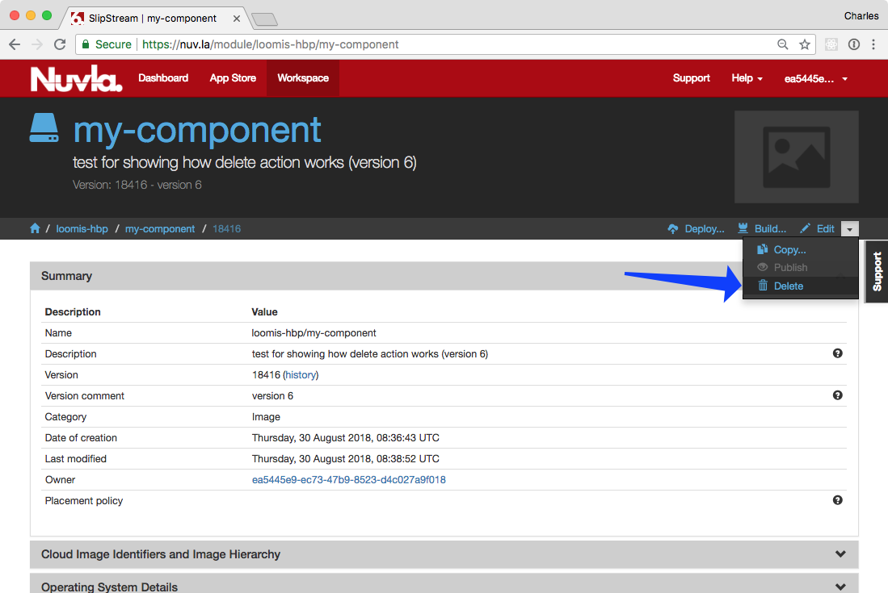
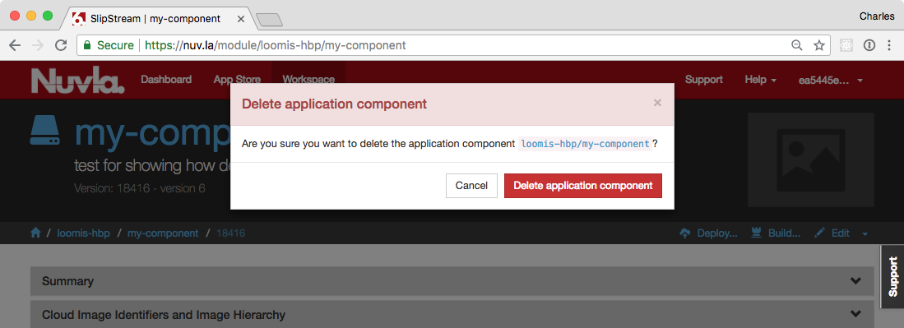
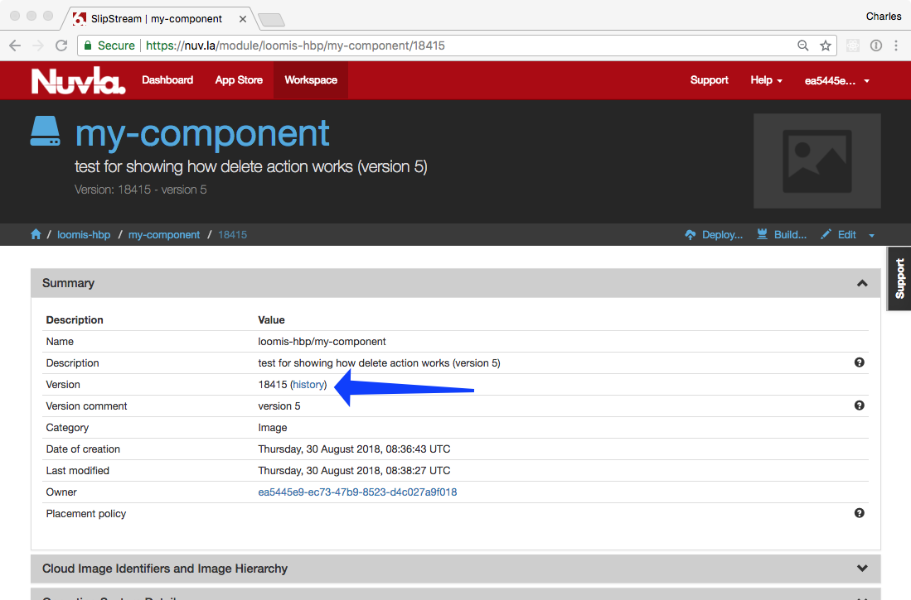
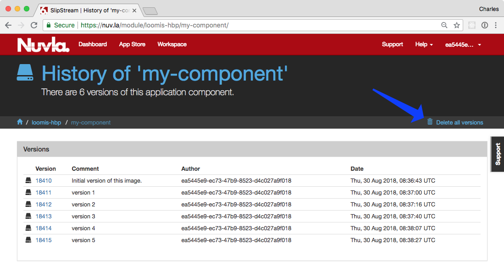
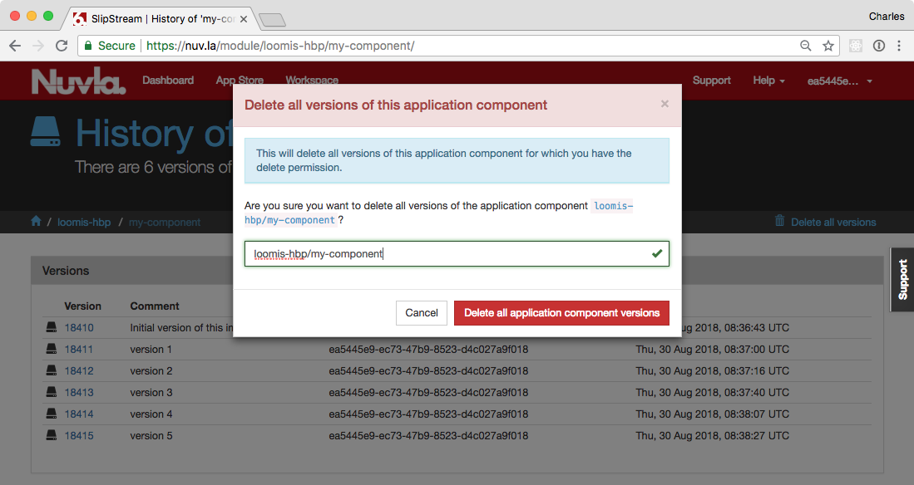

Deleting Modules
================

SlipStream saves all versions of all modules by default.  This allows
you to rollback to a previous version or to view the evolution of the
module.  There are times, however, where you would like to remove a
specific version of a module or all versions.

Delete Module Version
---------------------

When you view the detail page for module, you will see the "Delete"
action under the "Edit" dropdown near the top right of the page.  This
will be greyed out, if you don't have permission to delete the module.

When you click on "Delete" action, you will then see a dialog to
confirm the action.

This will delete **only the version of the module that you are
viewing.** After you have confirmed the action, you will be redirected
to the latest, existing version of the module (or to the parent, if
there are no remaining versions).

.. note::

   Project modules are not versioned.  The "Delete" action will delete
   the project entirely, provided that you have permission to do so
   and that the project contains no children.
   

Delete Entire Module
--------------------

There are times when you want to delete all versions of a module.
Although the versions can be deleted one at a time, this becomes
tedious for a module with a long history.

To delete all versions of a module, click on the "history" link next
to the "Version" field in the "Summary" section.

This will bring up the history that contains all visible versions of
the module.

This page contains the "Delete all versions" action.  Click on that
and you will then see a confirmation dialog.

You must provide the name of the module (as a protection) to enable
the confirmation button.  When you click on the confirmation, all
versions of the module will be deleted.

.. admonition:: EXERCISES

   1. Create a component with a number of different versions.
   2. Navigate to a specific version, delete it, and verify that it
      disappears from the module history.
   3. Use the "Delete all version" action from the history page and
      verify that the module disappears.

