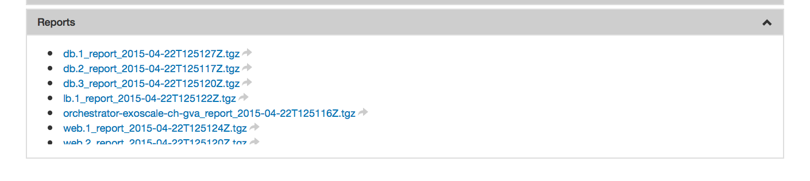

Deployment Logs
===============

Although it has not yet been mentioned, perhaps you have noticed that
for each deployment there is a "Reports" section on the run page.

At the end of the deployment phase, all of the logs from the
SlipStream recipes are collected into a tarball and sent back to the
server.  From there you can download them to diagnose any problems.

In the "Reporting" recipe, you can copy any additional files that you
would like bundled with the reports into the location defined by the
environmental variable ``SLIPSTREAM_REPORT_DIR``.
