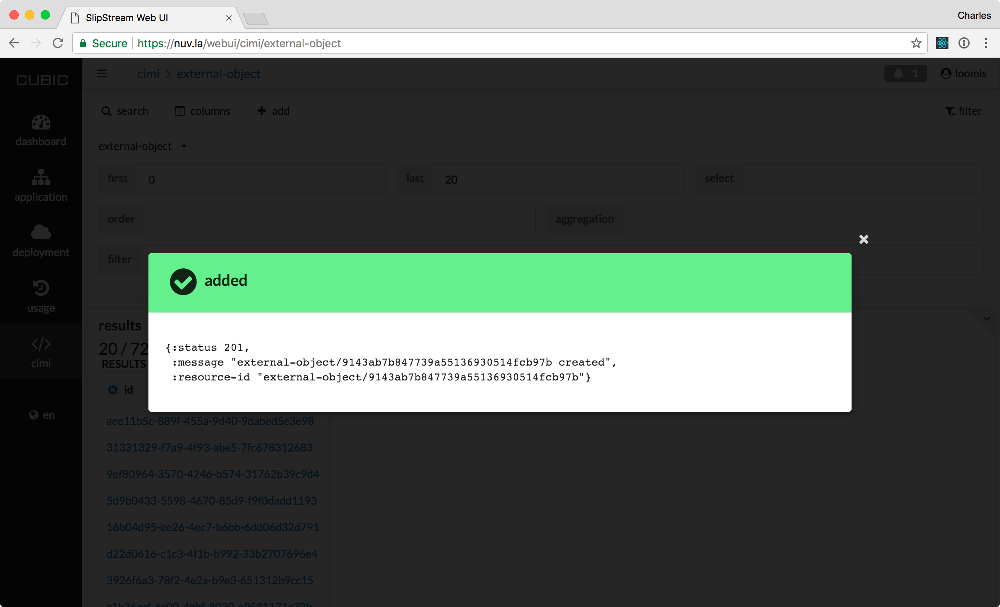
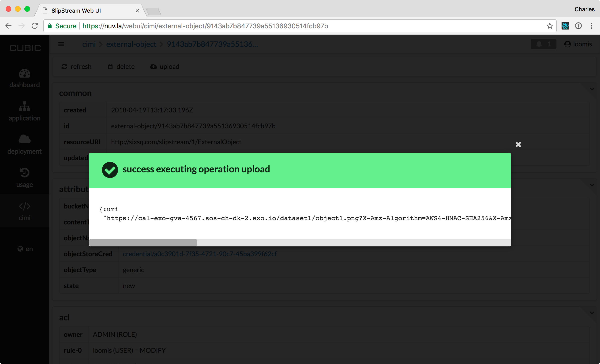

Links to Data Objects
=====================

Data objects can be very large and often contain binary data.  To
avoid capacity, performance, and security issues, the data objects are
not directly managed within the SlipStream database.  Instead,
SlipStream manages "links" to these data objects, providing "actions"
that facilitate creating, reading, writing, and deleting the objects.

The following sequence diagram provides an overview of these actions
and what entities are involved to complete them.

   Sequence Diagram of ExternalObject Actions

Create
------

The ExternalObject resource is a templated CIMI resource.  This means
that the creation request must reference an ExternalObjectTemplate
when creating a new ExternalObject resource.

When the server creates the resource, it:

 - Checks that the bucket exists, **creating the bucket** if necessary
   using the referenced credentials,
 - **Creates the ExternalObject** resource with the provided
   information, and
 - **Sets the state to "new"** in preparation of having the data
   uploaded to the object.

If the bucket doesn't exist and cannot be created, an error will be
returned.  The name of the object within the bucket depends on the
template used to create the object.

To create an ExternalObject resource via the web browser interface,
navigate to the `CIMI ExternalObject collection
<https://nuv.la/webui/cimi/external-object>`_ and click on the search
action at the top to see the list of existing objects.  You should see
a screenshot like the following, showing an "add" action that will
allow new reports to be created.

.. figure:: images/screenshots/external-object-collection.png
   :width: 70%
   :align: center

   List of ExternalObject Resources

When you click on the "add" action, you will be presented with a form
to create a new ExternalObject. In most cases, you will want to use
the "external-object-template/generic" template; the
"external-object-template/report" is for creating the reports from
deployments.

   Form to Create a New Generic ExternalObject

In this form, you can fill in the following information:

 - **resource template**: normally you will want to use the value
   "external-object-template/generic"
 - **Name**: optional, human-readable name for the resource
 - **Description**: optional, human-readable description of the
   resource
 - **External object content type**: optional, but strongly
   recommended MIME type of the object
 - **Object Store bucket name**: name of the bucket on the S3 storage
   service
 - **Object name**: name of the object in S3 storage, this can be a
   hierarchical name using slashes as separators.
 - **Object Store credentials**: reference to the cloud credential to
   use for the object. This implicitly defines the cloud being used.

The last three values are required.  The identifier for the resource
is a hashed value of the bucket and object names. **Only one
ExternalObject with the same bucket and object names can be created.**

When you click on "create", it will then create the ExternalObject
resource.  You should see a success message like the following.

   Successful Creation of Generic ExternalObject

Be sure to note the identifier of the created ExternalObject.  In this
case, the identifier is:

.. code-block:: sh

    external-object/9143ab7b847739a55136930514fcb97b

You can always use the search functionalities to find the resource
later, if necessary.

The creation process can also be done directly with the REST API.  The
process looks like the following.

.. code-block:: sh

  $ alias ss-curl='curl --cookie-jar ~/cookies -b ~/cookies -sS'
  $
  $ # create a session with the server
  $ export USER=...
  $ export PASS=...
  $ ss-curl -XPOST \
      -d username=${USER} \
      -d password=${PASS} \
      -d href=session-template/internal \
      https://nuv.la/api/session
  $
  $ # response: JSON with 201 status, session identifier
  $
  $ # JSON document to create a generic ExternalObject
  $ cat > eo-create.json <<EOF
  {
    "name": "dataset1/object1",
    "description": "test image for ExternalObject resource",
    "externalObjectTemplate": {
      "href": "external-object-template/generic",
      "objectStoreCred": {
        "href": "credential/a0c3901d-7f35-4721-90c7-45ba399f62cf"
      },
    "bucketName": "data-exo-gva",
    "objectName": "dataset1/object1.png",
    "contentType": "images/png"
    }
  }
  EOF

  $ # create the ExternalObject
  $ ss-curl -XPOST \
      -H 'content-type:application/json' \
      -d@eo-create.json \
      https://nuv.la/api/external-object
  $
  $ # response: JSON document with 201 status, external object identifer

This should create the ExternalObject resource, similarly to the way
it was done through the web interface. 

Upload Data
-----------

When the ExternalObject resource is in the "new" state, anyone with
"modify" access to the resource can request a presigned upload URL for
the S3 object via the CIMI action "upload" on the resource.  A
lifetime can be specified for the returned URL to limit security
concerns with a presigned URL.

The returned presigned URL can be used to upload the contents of the
object directly to the S3 object store via HTTPS.  This is convenient
because it does not require 1) direct authentication or 2) special
software to be installed by the client uploading the data.

Once the presigned upload URL has been provided, the state of the
ExternalObject resource will be changed to "uploading".  Upload URLs
can still be requested (for example, in the case of a data upload
error), but the object cannot yet be downloaded.

In our case, we will visit the detail page for the created
ExternalObject resource.  You can click on the link in the collection
or directly navigate to the URL which will have the UUID of the
resource appended to ``https://nuv.la/webui/cimi/external-object/``.

   Detail of Created ExternalObject Resource

On the detail page, you can see the actions that are possible.  To
upload the content of the ExternalObject, click on "upload" and then
note the returned upload URL. 

   Requesting ExternalObject Upload URL

To request an upload URL through ``curl``, you can execute the
following command.  (This assumes that you've defined the alias above
and still have an active session.)

.. code-block:: sh

   $ ss-curl -XGET \
       https://nuv.la/api/external-object/0565e3953e2f7ee033779b10533c826/upload
   $
   $ # response: JSON with uri key with the upload URL

You should extract the correct URL to use from the "operations" key
provided in the object itself. 

With the upload URL (either from the web interface or the command
line), any HTTP client can upload contents to the ExternalObject. This
is a presigned URL with a limited lifetime.  To upload the object
contents, you can do the following:

.. code-block:: sh
                
   $ export LINK="https://slipstream-reports.sos-ch-dk-2.exo.io/..."
   $
   $ curl -XPUT \
       -T@screenshot.png \
       -H content-type:images/png \       
       ${LINK} 
   $ echo $?
   0

This example uses ``curl``, but any HTTP client could have been
used.

.. warning: If you provided a content type for the object, you MUST
            provide a header in the request with the exact same value.

.. note: Direct uploads of data from the web browser interface are not
         yet supported.

Ready
-----

To prevent further changes to the object and to allow others to
download the data, you must set the ExternalObject resource's state to
"ready".  This is done by sending a POST request to the "ready" action
URL.

For the web browser interface, you can just click on the "ready"
button that appears on the detail page of the ExternalObject
resource. You should see a success modal from this action.  If you
refresh the detail page, you'll see that the status has changed to
"ready". 

   Setting the Ready State of ExternalObject

When using ``curl`` or another HTTP client, the request looks like the
following.

.. code-block: sh

   $ ss-curl ...TBD...

Again this assumes that you have an active session.  The URL that you
use should be taken from the "operations" attribute in the
ExternalObject document. 

Once the object is in the ready state, upload URLs can no longer
be requested; the download action will be available to those with
"view" access. 

Download Data
-------------

When the ExternalObject resource is in the "ready" state, anyone with
"view" access to the resource can request a presigned download URL for
the S3 object via the CIMI action "getDownloadURL" on the resource. A
lifetime can be specified for the returned presigned URL.

Similarly to the upload URL, the returned URL allows access to the
data object directly on S3.  It does not require direct authentication
or special software by the client reading the data.

For the web browser interface, you can just click on the "download"
button that appears on the detail page of the ExternalObject
resource.

   Getting Download URL for ExternalObject (TBD...)

When using ``curl`` or another HTTP client, the request looks like the
following.

.. code-block: sh

   $ ss-curl ...TBD...

With this download URL, we can then verify the contents of the
ExternalObject.  You can either visit this URL with a web browser or
use another HTTP client.

.. code-block:: sh
                
   $ export LINK="https://slipstream-reports.sos-ch-dk-2.exo.io/..."
   $
   $ curl $LINK 
   This is new data! 
   $

Again, this is a time-limited, presigned URL that can be used by any
HTTP client.

Delete
------

Deleting an ExternalObject uses the standard CIMI delete pattern. This
action with also delete the referenced object in S3 storage.

The resource can also be deleted by clicking on the "delete" button on
the ExternalObject detail page in the web browser interface.  You must
confirm this via a dialog before it will actually be deleted.

The ``curl`` command to do the same thing is:

.. code-block: sh

   $ ss-curl ...TBD...

As usual you must have an active session to successfully execute the
delete action. 

ServiceOffer resources that reference that ExternalObject must be
kept synchonized manually for any changes to the ExternalObject
resources.  (Notably the ACLs and the references to ExternalObject
resources.)
