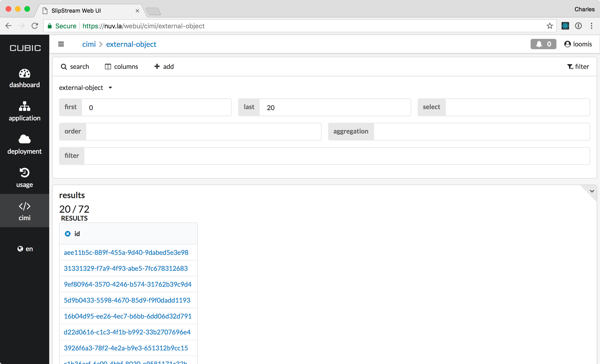

Links to Data Objects
=====================

Data objects can be very large and often contain binary data.  To
avoid capacity, performance, and security issues, the data objects are
not directly managed within the SlipStream database.  Instead,
SlipStream manages "links" to these data objects, providing "actions"
that facilitate creating, reading, writing, and deleting the objects.

The following sequence diagram provides an overview of these actions
and what entities are involved to complete them.

.. figure:: images/diagrams/external-object-sequence-diagram.png
   :width: 70%
   :align: center

   Sequence Diagram of ExternalObject Actions

Create
------

The ExternalObject resource is a templated CIMI resource.  This means
that the creation request must reference an ExternalObjectTemplate
(which will then require a reference to a cloud credential and a
bucket name) when creating a new ExternalObject resource.

When the server creates the resource, it:

 - Checks that the bucket exists, creating it if necessary using the
   referenced credentials,
 - Creates the ExternalObject resource with the provided information,
   and
 - Sets the state of the resource to "created" in preparation of
   having the data uploaded to the object.

If the bucket doesn't exist and cannot be created, an error will be
returned.  The name of the object within the bucket is the same as the
identifier of the created ExternalObject resource.

To create a report, for example, navigate to the `CIMI ExternalObject
collection <https://nuv.la/webui/cimi/external-object>`_ and click on
the search button to see the list of reports.  You should see a
screenshot like the following with a "+" button that allows new
reports to be created.

   List of ExternalObject Resources

When you click on the "+" button, you will be presented with a form to
create a new ExternalObject.

.. figure:: images/screenshots/external-object-create-form.png
   :width: 70%
   :align: center

   Form to Create a New ExternalObject Report

When you click on "create", it will then create the ExternalObject
resource.  You should see a success message like the following.

.. figure:: images/screenshots/external-object-create-success.png
   :width: 70%
   :align: center

   Successful Creation of ExternalObject Report

Be sure to note the identifier of the created ExternalObject.  In this
case, the identifier is:

.. code-block:: sh

    external-object/db19c2b9-5ee1-447e-899a-33d9cefd8eb9

You can always use the search functionalities to find the resource
later, if necessary.

Write Data
----------

When the ExternalObject resource is in the "new" state, anyone with
"modify" access to the resource can request a presigned write URL for
the S3 object via the CIMI action "getWriteURL" on the resource.  A
lifetime can be specified for the returned URL to limit security
concerns with a presigned URL.

The returned presigned URL can be used to directly upload the contents
of the object directly on the S3 object store via HTTPS.  This is
convenient because it does not require 1) direct authentication or 2)
special software to be installed by the client uploading the data.

Once the presigned, write URL has been provided, the state of the
ExternalObject resource will be changed to "ready" and no further
write URLs can be requested.

In our case, we will visit the detail page for the created
ExternalObject resource.  You can click on the link in the collection
or directly navigate to the URL which will have the UUID of the
resource appended to ``https://nuv.la/webui/cimi/external-object/``.

.. figure:: images/screenshots/external-object-detail.png
   :width: 70%
   :align: center

   Detail of Created ExternalObject Resource

On the detail page, you can see the actions that are possible.  To
upload the content of the ExternalObject, click on "upload" and then
note the returned upload URL. 

.. figure:: images/screenshots/external-object-upload-url.png
   :width: 70%
   :align: center

   Requesting ExternalObject Upload URL

With this URL, any HTTP client can upload contents to the
ExternalObject. This is a presigned URL with a limited lifetime.  To
create and upload data, you can do the following:

.. code-block:: sh
                
   $ cat > my-data.txt
   This is new data!
   $ 
   $ export LINK="https://slipstream-reports.sos-ch-dk-2.exo.io/..."
   $
   $ curl -X PUT -d @my-data.txt $LINK 
   $ echo $?
   0

This example uses ``curl``, but any HTTP client could have been used. 

Read Data
---------

When the ExternalObject resource is in the "ready" state, anyone with
"view" access to the resource can request a presigned read URL for the
S3 object via the CIMI action "getReadURL" on the resource. A lifetime
can be specified for the returned presigned URL.

Similarly to the write URL, the returned URL allows access to the data
object directly on S3.  It does not require direct authentication or
special software by the client reading the data.

From the detail page, click on the "download" button and recover the
URL in the same way that was done for the upload URL.  With this URL,
we can then verify the contents of the ExternalObject. 

.. code-block:: sh
                
   $ export LINK="https://slipstream-reports.sos-ch-dk-2.exo.io/..."
   $
   $ curl $LINK 
   This is new data! 
   $

Again, this is a time-limited, presigned URL that can be used from any
HTTP client.

Delete
------

Deleting an ExternalObject, using the standard CIMI delete pattern,
will delete the referenced object as well as the ExternalObject
resource itself. ServiceOffer resources that reference that
ExternalObject must be manually kept synchonized to the change.

The resource can also be deleted by clicking on the "delete" button on
the ExternalObject detail page.  You must confirm this via a dialog
before it will actually be deleted.
