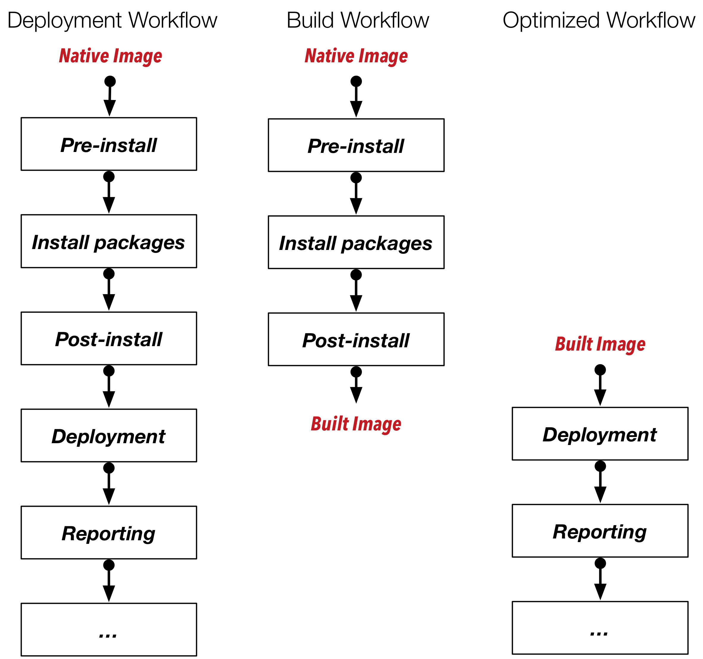
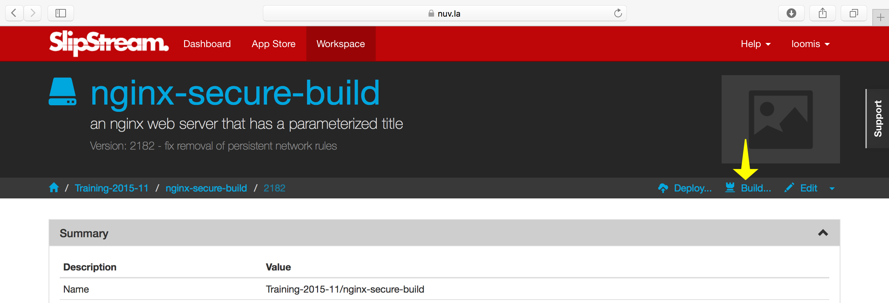

Faster Deployments
==================

The software installation and much of the configuration for a
component are static.  Repeating this for every deployment increases
the startup latency for the component and for the application as a
whole.

"Building" an image, creates a new native image within a cloud
infrastructure that already includes the static initialization,
reducing the deployment latency.

This should only be considered as an optimization after the deployment
is debugged and working because:

- Building an image can take a significant amount of time (20+
  minutes)
- Not all clouds support user-generated images
- Some clouds require additional configuration to share the generated
  images with others
- Securing persistent images and ensuring they work can be difficult.

Nonetheless, the additional effort can significantly speed the
deployment for frequently deployed applications, improving the
customer's experience and reducing their costs.

Worth the Effort?
-----------------

Before deciding whether to build an image, measure the latencies in
your actual application deployment.  For each deployed application you
can see the times at which the application entered each state.  The
time spent in the "executing" state is the maximum amount of time by
which you can reduce the startup times.

Also determine whether the clouds that you target support user-defined
images.  If you will need to support cloud infrastructures that both
support and do not support user-defined images, then you will need to
be especially careful to ensure that the component behaves identically
on both infrastructures.

Understanding Workflows
-----------------------

Presumably if you're still reading, then you've decided that building
images is interesting for your application.  You'll need to understand
how the standard application workflow differs from the build
workflow.  The following diagram shows which scripts are run for the
standard deployment workflow, for the build workflow, and for the
optimized workflow with a built image.

As you can see from the diagram, the "Pre-install", "Install
packages", and "Post-install" are not run in the optimized workflow
because those actions were already completed in the build workflow and
saved in the created image.  The work done in those phases represents
the speed up you can achieve by building an image.

Building an Image
-----------------

If you've followed the advice about what type of actions to put into
each recipe, then your component should be nearly ready to be built.
The important distinction is to ensure that **static** installation
and configuration is done in the "Post-install" recipe and before.
All dynamic configuration should be put into the "Deployment" recipe.

However to ensure that the component works identically on all of the
clouds, you should consider adding a few things to your component
description:

- Operating systems tend to persist networking configuration.  Make
  sure all such files are removed from the system in the
  "Post-install" recipe.  This usually comes down to a command like:
  ``rm -f /etc/udev/rules.d/*net*.rules``.

- Any command histories, temporary files, etc. will be saved in the
  generated image.  If you've used or generated sensitive information,
  be sure to remove it from the virtual machine in the "Post-install"
  recipe.

- Upgrading a system often involves the installation of a new
  kernel. To ensure that the new kernel is used in both standard and
  optimized workflows, you may want to insert a reboot of the machine
  at the end of the "Post-install" recipe.  SlipStream is tolerant of
  such reboots.

- Similarly for a built image, you may want to also upgrade the system
  at the beginning of the "Deployment" recipe to pick up any new
  packages since the image was created.

After these changes, building an image is just a matter of clicking on
the "Build..." button for the component you want to create.

You can then follow the progress on the dashboard as with any other
deployment.  When completed, you will see an image identifier has been
added to the component in the "Cloud Image Identifiers and Image
Hierarchy" section.

When SlipStream encounters a component with such an image identifier
it will always use the optimized workflow for that cloud.

.. warning::

   SlipStream will invalidate the built image if any of "Pre-install", "Install
   packages" or "Post-install" of the component are modified; you must rebuild
   the component after any change in any of those steps of the Application
   Workflow.  Also, SlipStream will not delete the built image from the cloud.
   That must be done manually, if desired.

