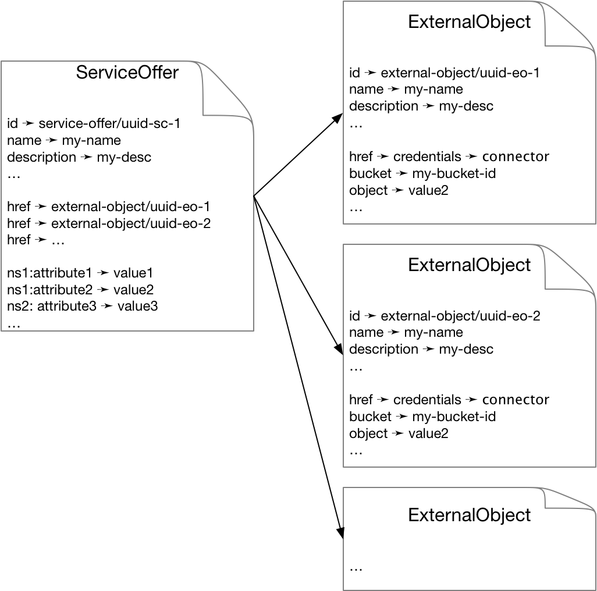

Metadata
========

ExternalObject resources support the common CIMI attributes, such as
``name`` and ``description``. These attributes can be used to provide
descriptive metadata for the underlying data objects.  The standard
CIMI filtering mechanisms can then be used to select ExternalObject
resources based on that metadata.  These limited attributes can be
sufficient for simple use cases.

Most use cases, however, will require a richer set of metadata.
SlipStream already provides a resource that allows for rich metadata
to be provided for other managed resources--the ServiceOffer.  In the
same way that ServiceOffers can describe Virtual Machines offers, they
can provide metadata for ExternalObjects as well.  In this way, the
CIMI filtering capabilities can be used with the richer metadata to
provide full-featured search of data sets.

As the schema for the ServiceOffer is completely open, all metadata
associated with an ExternalObject, both general and domain-specific,
can be tied to the underlying data object.  The relationship between
these resources is shown below.

   SlipStream Data Management Resources

