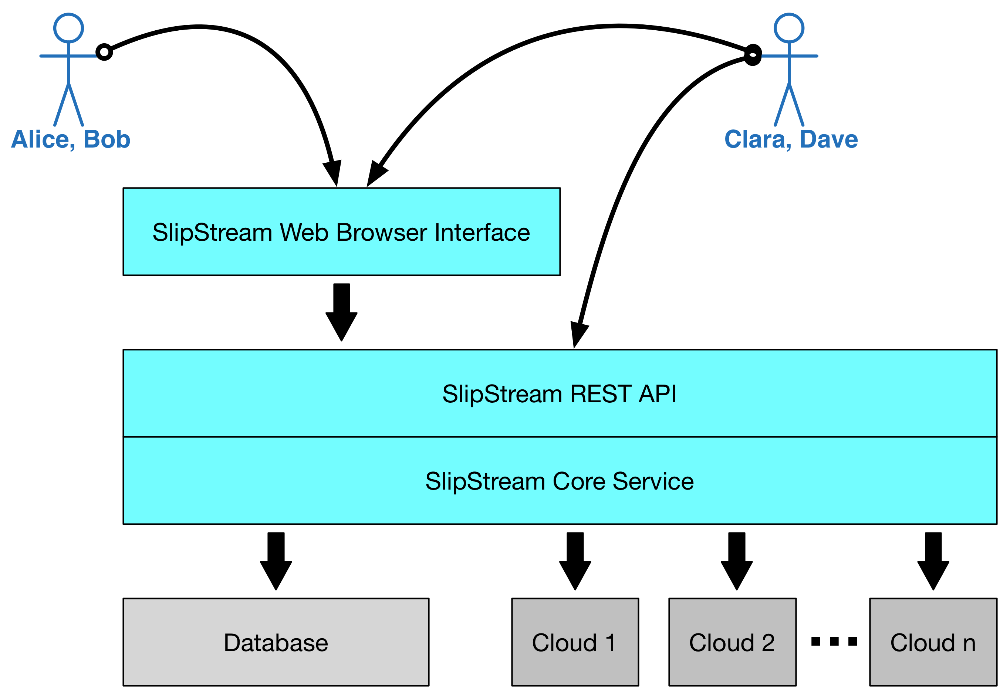

SlipStream Ecosystem
====================

Cloud technologies provide real benefits to users and organizations,
but they also have their own challenges.  For example, at the
"Infrastructure as a Service" level:

- Incompatible APIs
   Make it difficult to move applications from one cloud to another
   and complicate the simultaneous use of different clouds.

- Opaque VMs
   Keeping track of what virtual machines contain (data and services)
   and managing their updates are difficult.

- Component vs. Application
   Most applications comprise multiple layers with numerous individual
   machines.  Cloud services oriented towards single VMs make
   application management more tedious.

SlipStream addresses these challenges by providing its users with an
efficient platform for the management of the full lifecycle of cloud
applications. 

Users and Benefits
------------------

A number of different types of people within an organization can benefit
from SlipStream. We've created personas to describe those people and how
they benefit.

--------------------

.. image:: images/icons/alice.png
   :height: 115
   :width: 100
   :align: left

**Alice** is busy working on different projects. She needs IT
applications and resources, but has little patience for IT related
issues. She benefits from the SlipStream App Store where she can start
the applications she needs with one click.

--------------------

**Bob** manages a number of workers taking advantage of cloud
resources. He wants an overview of their use of those resources to
understand costs and their evolving needs. SlipStream provides the
ability to monitor resource utilization.

--------------------

**Clara** develops cloud applications for people within her
organization. She benefits from SlipStream by creating a rich catalog
of services that can be automatically and reliably deployed.

--------------------

.. image:: images/icons/dave.png
   :height: 115
   :width: 100
   :align: right

**Dave** manages the SlipStream installation. He's able to integrate
his own cloud infrastructure into SlipStream and control what external
cloud resources are available to his users.

--------------------

This tutorial focuses primarily on "Clara", showing how applications
can be brought into SlipStream and made available to the "Alices" in
her organization.  Nonetheless, you will see some features (e.g. usage
statistics) that will appeal to the Bobs and Daves in your
organization.

Interacting with SlipStream
---------------------------

All of the users will interact with SlipStream primarily through the
**web-based user interface**.  This provides a graphical view of the
system allowing applications to be defined, deployed, and managed.

At the core of SlipStream, however, is a **REST API**: a
resource-oriented model implemented over the HTTP protocol.  The API
can be accessed from any programming language, allowing SlipStream to
be driven from other systems and integrated into existing application
management processes.

There is also a **command line client** that takes advantage of the
REST API.  It can be used for quick interactions with SlipStream
without the need for a web browser.  It is used extensively in
application definitions to coordinate service configuration and to
pass information back to the SlipStream user.

