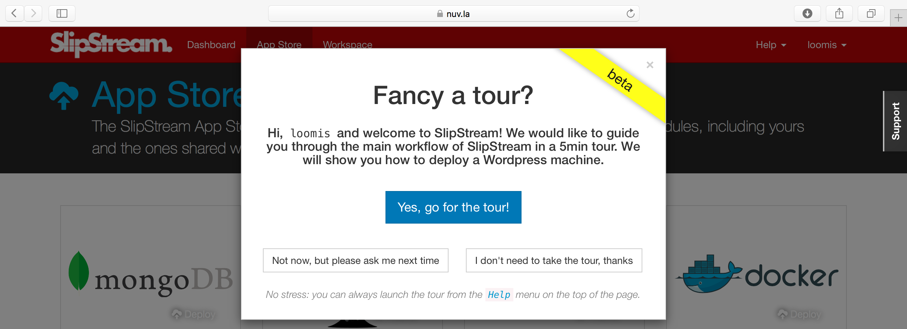

Web Interface Tour
==================

We postponed going through the inline tour of the SlipStream interface
to allow us to concentrate on the configuration of our cloud
credentials.   We will go through that tour now because it:

- Provides a good overview of the major sections of the SlipStream web
  interface and
- Verifies that our user profile and cloud accounts have been
  configured correctly.

To activate the tour, choose the "Start guided tour" option below the
"Help" menu.  You should see a splash screen like the following:

Click on the "Yes, go for the tour!" button to follow the tour.  This
will lead you through the interface and show you how to deploy a
simple application from the App Store.

The tour is aimed at "Alice", but it is useful also for developers
("Clara") to see how the App Store can simplify the deployment of
cloud applications for end-users.

.. note::

   In the tour workflow, you were redirected to the run page after you
   started an application.  In the normal workflow, you are redirected
   to the dashboard instead.

.. admonition:: EXERCISES

   1. Follow the tour and verify that the Wordpress deployment works
      for your account.
   2. Correct any problems that you encounter.  Be sure to terminate
      your Wordpress deployment.
