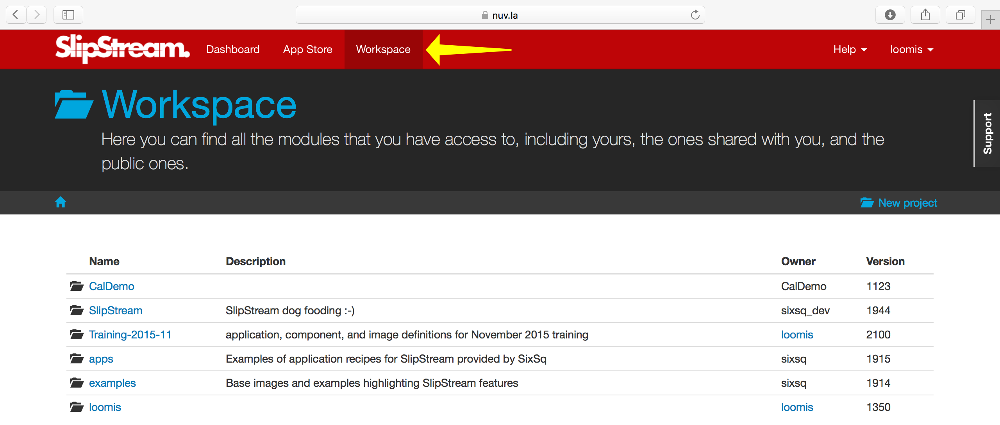
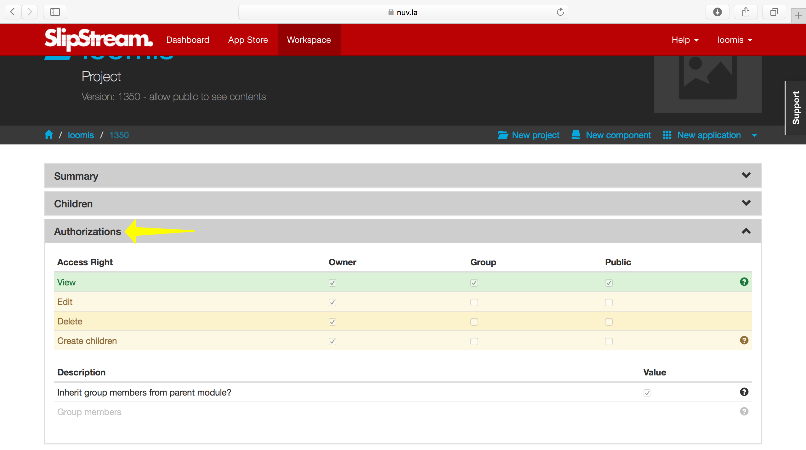

Workspace
=========

The workspace allows you to create, store, and organize your projects
and modules (image, component, and application definitions).

In this section you'll learn how to:

- Create and navigate projects,
- Protect or share your projects and modules, and
- Understand versioning within SlipStream.

Projects
--------

At the top-level of the workspace, you will see your projects as well
as any projects that have been shared with you.

"Projects" are essentially folders, in which you can keep related
images, components, and applications together.  As projects can
contain other projects, you can create hierarchies to help organize
your work.

There are two important projects that are shared with everyone:

- The "examples/images" project contains basic operating system images
  (like Ubuntu 14.04 or 16.04 and CentOS 6 or 7) that are reused extensively in
  the definition of application components.
- The "apps" project contains set of application definitions created
  by SixSq to highlight features of SlipStream and to serve as a basis
  for your own applications.

When you have time, it is instructive to look through the definitions
of those components and applications to understand how to take
advantage of SlipStream features.

.. important::

    Because the **root of the workspace is shared by all users**, it
    is recommended that you create your own top-level project (usually
    with the same name as your username) to hold your private
    modules.

Access Control
--------------

SlipStream has a uniform access control model across all modules.
Permissions can be defined separately for three categories of users:

 - **User** is the owner of the module
 - **Group** is a list of other users
 - **Public** is the set of all **authenticated** users

The list of users for a group can be defined explicitly on
a module or inherited from the enclosing project.

.. important::

    Modules may optionally inherit the group definition (but not
    permissions) from its enclosing project (grand-project, etc.).
    Nothing other than the group definition can be inherited from a
    project.

The available permissions are different depending on the type of
module.  The following screenshot shows the available permissions for
a typical project.  The access control information is always visible
in the "Authorizations" section of the module.

Using the access control mechanisms, you can **share your work with
other people on the SlipStream server**.  You can also request that
the SlipStream administrator publish your module in the App Store to
make it more visible to others.

.. important::

    When you share a module with someone else, you allow them to see
    and optionally execute the application definition.  If they run
    the application, it will use **their cloud accounts** and not
    yours.  You're sharing your knowledge, not your credit card!

Versioning
----------

The full history for all modules is kept by the SlipStream server;
each saved modification of a module is associated with a unique
version number.  The version number and a link to the full history is
available in the "Summary" section of the module.

.. tip::

    Every time you save a module, you may provide an optional
    description of your changes.  These comments are available in the
    module history and help understand the evolution of the module.
    Providing these comments is best practice!

.. admonition:: EXERCISES

   1. Create your top-level project.
   2. Verify with your neighbors that you can see your own project but
      not theirs.
   3. Change the permissions on the module (either Group or Public)
      and then verify that others can see your project.
   4. Change your project back to a private module when your
      finished.
   5. View the history of your project, containing the versions and
      comments.  Are the version numbers sequential?
