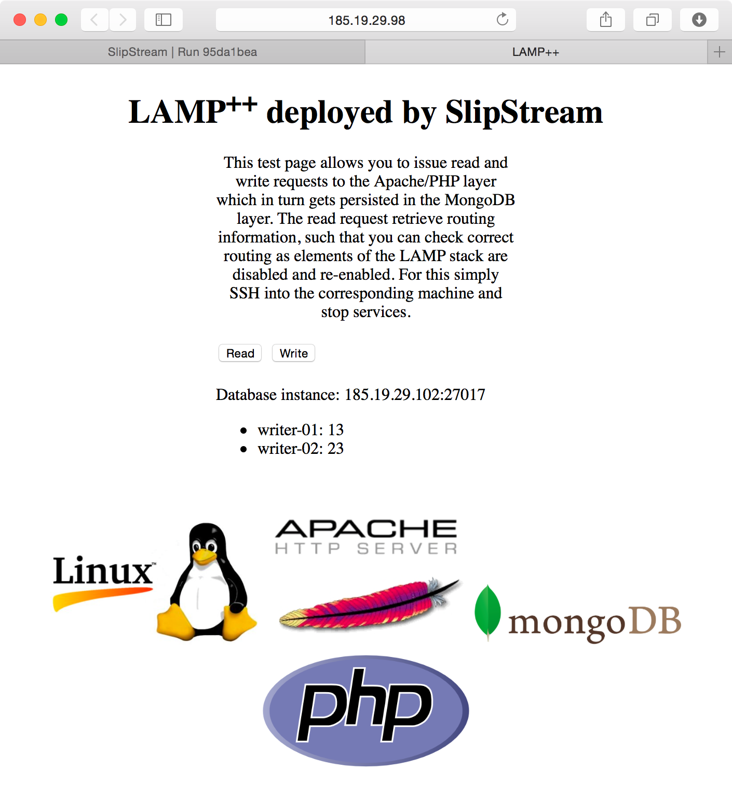

Resiliant, high-availability deployments of 3-tiered web applications
can be complex and error prone.  SlipStream can manage such complex
applications, ensuring both consistency and reliability of the
deployment.

# LAMP++ Application

The LAMP++ (Linux, Apache, MongoDB, and PHP) application is an example
3-tiered web application using a load balancer to distribute requests
through multiple web front-ends and a distributed MongoDB database. By
default, the deployment has:

  - An HAProxy node for load-balancing the web front-ends
  - 2 web front-ends running Apache
  - 3 MongoDB nodes running with a quorum of 2

The web front-end contains an application page that calls PHP scripts
to read and write data in the MongoDB database.  The information about
how many requests have gone through each server shows how data flows
through the front-ends. 

The run page for this deployment shows the topology of the application
that will be deployed.

Following the link to the deployed application, one can see which
database node is being accessed and the distribution of write requests
between the two front-end servers.  The requests are roughly
distributed uniformly between the front end servers.

# Showing Redundancy

However, this is a deployment of the LAMP stack that is resiliant to
failure.  This can be shown for instance by logging into one of the
front-end nodes and turning off the apache server.  In this case all
of the requests will go through a single front end.  This screenshot
shows the asymmetry.

The same test can be done with the MongoDB nodes.  If one is removed,
the system should still function normally.  However, since the system
is running with a quorum of 2, the service will fail if two of the
MongoDB nodes are stopped. 

