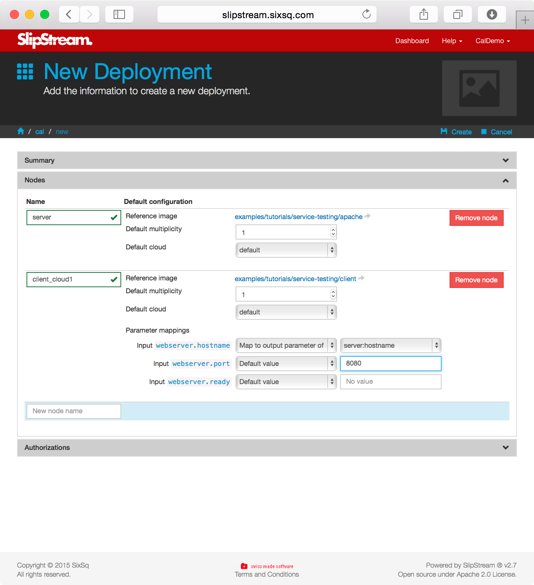

Although some useful applications can be deployed as single nodes,
most applications nowadays are large, multilayer beasts with several
different functional blocks.  The typical 3-tiered web application
falls into this category with its load balancer, application
front-ends, and database, usually all with redundancy and failover. 

In this section you will learn how to:

  - Combine image definitions into a multi-node deployment
  - Connect parameters between application components
  - Coordinate the configuration of the components

# Deployment Modules

A deployment is defines as a set of nodes (that are tied to image
definitions) that will be deployed together.  The deployment can also
define the mapping between the input/output parameters of the nodes
that are tied together. 

The first section of the new deployment page just asks for generic
information about the deployment. 

The second section provides information about the nodes that will
comprise the full application deployment.  If there are input
parameters for a node, then you can set the values here or provide a
link to another node's output parameter. 

# Viewing the LAMP++ Example

As you've seen earlier in the tutorial, the LAMP++ example provides a
compete definition of a standard, 3-tier web application.  It provides
a rundundant distributed database and multiple front-ends controlled
through an active HA load balancer.  This serves as an excellent
starting point for complex deployments and shows how complex,
resilient services can be controlled and managed through SlipStream. 

# Exercises

  1. Create your own client machine and verify that it can talk with
     your web server. 
  2. Automate the connection between client and server, using the
     parameters to define what text should be expected from the
     server.
