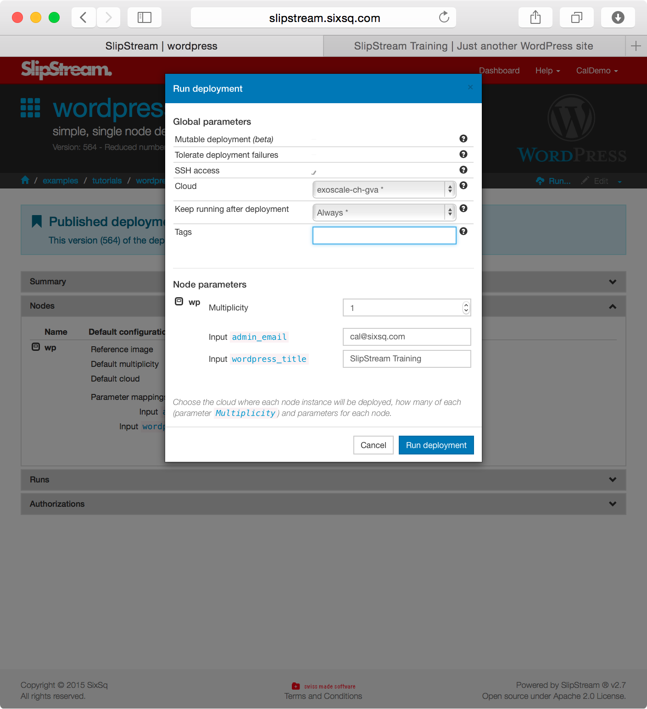
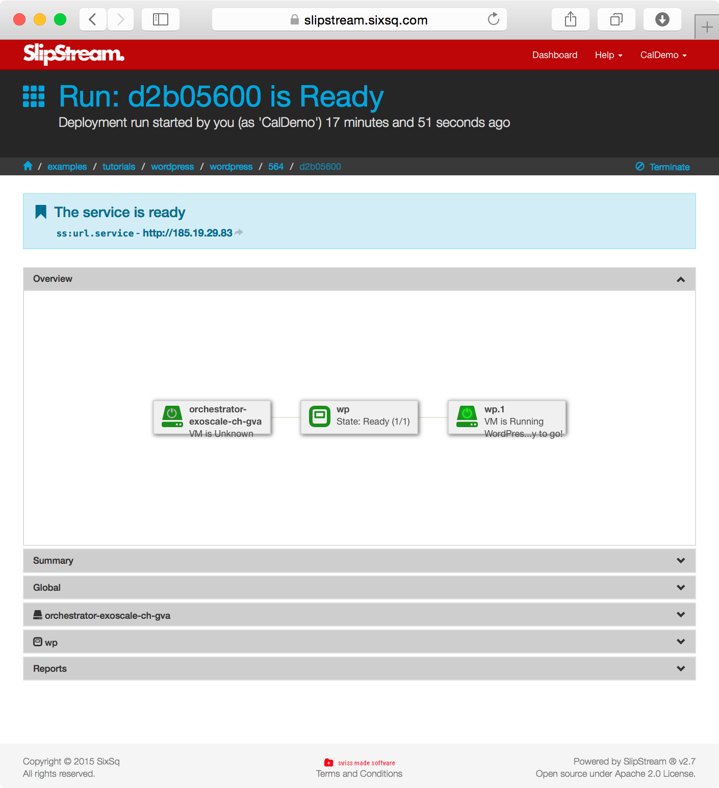
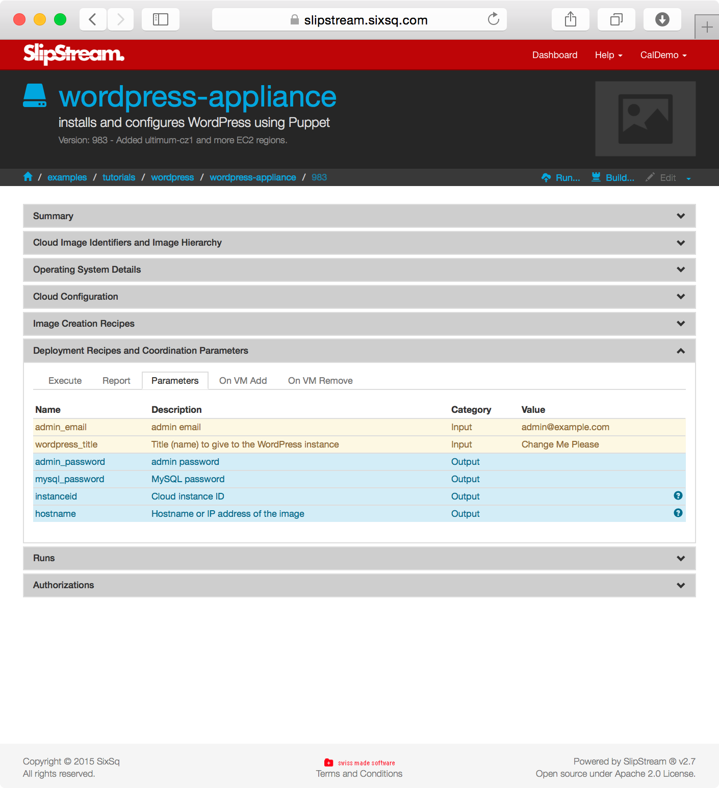

Many common applications require only a single node to run.  These
simple can also usually be easily parameterized so that a single
application definition can be used to start many customized
instances. 

In this section you'll learn how to:

  - Parameterize an application
  - Understand how installation and configuration is automated
  - Pass information between the application and the user
  - Share a deployment with other users

# Wordpress

One example of a simple application is Wordpress, a common blogging
platform.  To deploy an instance of Wordpress, just click on the
"Deploy" button from the App Store.  You will presented with a run
dialog that requests the values for a few parameters.

Filling in those parameters and then clicking on the "Run Image"
button will launch the image and bring up the usual "Run" page
where you can follow the status of the application. 

If you look at the definition of the `wordpress` image, you will
see where the parameters for the image are defined. 

When creating a new image, you are free to define any parameters that
make sense for your application.  Note however, that the values are
all string values and any validation must be handled by the deployment
script. 

Under the "Execute" tab on this same page, you can see the deployment
script that is used.  The parameters can be controlled via the
SlipStream client's `ss-set` and `ss-get` commands.  More on this
later. 

You'll also notice that this configuration uses the Puppet
configuration management system.  SlipStream is agnostic concerning
what tools are used for installation and configuration; you are free
to use your existing tools and knowledge when importing applications
into SlipStream.

# R-Studio

R-Studio is a data analysis platform that provides a web-based
interface to the R statistical analysis software.  The actual
deployment is similar to that from Wordpress, although it uses just a
bash script for installation rather than a configuration management
system like Puppet. 

Because there may be many instances of a given application running, it
is necessary to ensure that only the person deploying the application
has access to it.  If you deploy R-Studio from the App Store, you will
be faced with a login page when accessing the instance.

Where can this information be found?  In the deployment parameters.
The username and password can be found in the `machine:rstudio_user`
and `machine:rstudio_pswd` parameters.  The password was generated
with the `ss-random` command from the deployment script and
communicated through SlipStream to the user.

# Making Modules Public

Often you will want to share an image or deployment with another
user.  You can do this by modifying the permissions in the module
definition.  Looking at the Wordpress definition, you can see the
following.

By letting "Public" view and run the deployment, it can be shared with
other users.  If you want to share with a more constrained group, then
you can provide the list of users and set the "Group" permissions. 

Public applications can also be "Published" in the App Store.  Once
this is done, the application will be visible from a tile on
everyone's home page.  Only accounts with administrator priviledges
can publish modules. 

# Exercises

For these exercises, you'll need to use the SlipStream client commands
that are discussed in detail in the next section.  Use the R-Studio
and Wordpress deployments to guess how these commands work. 

  1. Modify your image, to install and configure a web server.
  2. Do the installation directly with a command in the deployment
     script and also via a package definition. 
  3. Create an input parameter that provides text on the home page of
     the web site.  Use this value to update the home page.
  4. Make the image public.  Run the image of another person in the
     class. 
  5. Protect the web server with a randomly generated password.
     Define the parameters to pass this information to the user. 
