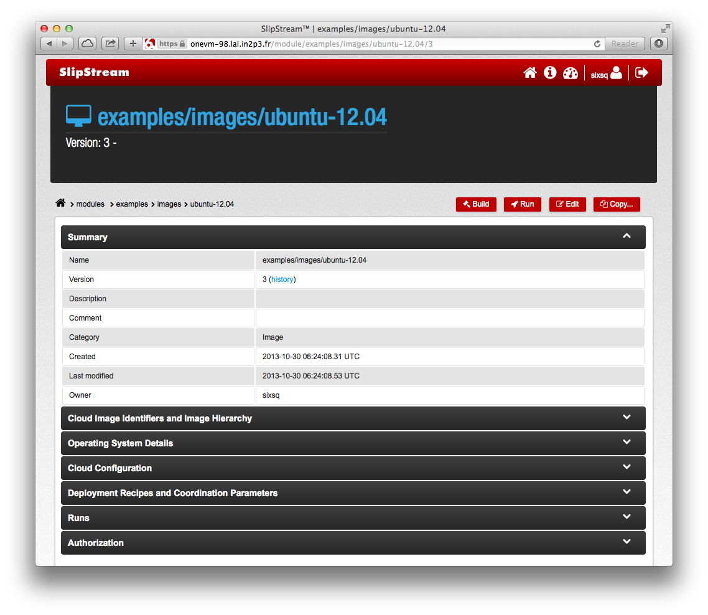
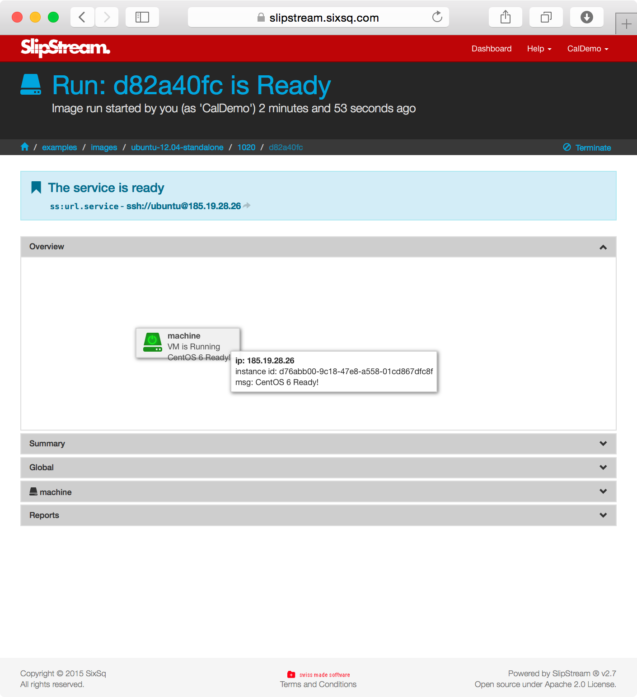

End-users will likely use SlipStream as a **resource provisioning
engine** to deploy predefined virtual machines and multi-machine
applications. 

In this section you'll learn how to:

  - Reference native images within the cloud infrastructures
  - Change the resource allocations for an image
  - Run a simple image, and
  - Update the software within the running machine instance 

# Cloud Firewalls

Currently SlipStream does not manage the firewalls associated with the
cloud infrastructures.  Because of this, you must configure the
default firewall settings on the clouds you use to open the ports you
need for your applications.  For this tutorial, opening the following
ports are useful.

| SSH     | TCP      | 22        |
| VNC     | TCP      | 5900-5902 |
| RDP     | TCP, UDP | 3389      |
| HTTP    | TCP      | 80        |
| HTTPS   | TCP      | 443       |
| MongoDB | TCP      | 27017     |

# Run a Virtual Machine

At its simplest, SlipStream can be used to launch individual virtual
machines.  To show how this is done, navigate to the
`examples/images` module.  You will see a set of minimal images that
can be used directly or as part of a coordinated deployment.

Clicking on the `ubuntu-12.04-standalone` module, you should see a
screenshot like the following.

The sections provide various information about the image itself.  In
this case this is a simple native image for all clouds.  You can see
the actual image identifier that will be used in each cloud in the
"Cloud Image Identifiers..." section.

> Both simple and "standalone" versions of the basic images are
> provided.  The "standalone" versions provide a clickable link to log
> into the machine via SSH and also provide a VNC (or RPC) server to
> use a remote desktop.  Use "standalone" for quick access to a
> machine; use the simple versions for references in other images.
{: .tip}

To run an instance of this machine, click on the "Run" button.  This
will redirect you to a page showing the status of the deployment.
This page is actively updated, so that you can see when the machine is
available.

To see the status of the virtual machine, just hover over the box
representing the virtual machine.  When it is ready, you can either
click on the service link at the top if your browser is setup for
"ssh://" URLs.

Or you can log in manually from the command line, using the username
and IP address on the run page:

    $ ssh ubuntu@185.19.28.26
    Welcome to Ubuntu 12.04.5 LTS (GNU/Linux 3.2.0-70-virtual x86_64)
    ...
    $

> Note that the user name may change depending on the underlying
> native image being used. The names "root" and "ubuntu" are common.
{: .important}

You might also want to try to log into the machine through VNC.  You
will need to give the IP address of the machine to your VNC client,
**with ':1' appended to the end**.  The password for the connection
can be obtained from the parameter `machine:vnc_password` in the
"Machine" section of the "Run" page.

# Machine Resources

Very often you will want to tailor the resources allocated to the
machine.  These configurations are done on a per-cloud basis in the
"Cloud Configuration" section of the image.

Normally, you will not be able to change the resource allocation for
image definitions that are not owned by you.  However, you can make a
copy of the image and change the resource allocations in the copy.
Similarly, you can update the resource allocations in other images you
create that reference one of these images.

> The names (t-shirt sizes) and resource definitions are not standard
> between the cloud services.  You will need to consult the
> documentation for each service to understand the correct values.
{: .tip}

# Installing a Web Server

Once you have 'root' access to the machine, you can install and
configure it as you'd like. For example, let's install a web server by
hand and show that it works.

To install the web server, just use the standard `apt-get` command.

    $ # become root to avoid lots of 'sudo' commands
    $ sudo su -
    $
    $ # update the OS just to make sure all's OK
    $ apt-get update
    Get:1 http://security.ubuntu.com precise-security Release.gpg [198 B]
    ...

    $ # now install the Apache web server
    $ apt-get -y install apache2
    ...
    Unpacking apache2 (from .../apache2_2.2.22-1ubuntu1_amd64.deb) ...
    ...
    Setting up apache2-mpm-worker (2.2.22-1ubuntu1) ...
     * Starting web server apache2
    Setting up apache2 (2.2.22-1ubuntu1) ...
    Setting up ssl-cert (1.0.28) ...
    Processing triggers for libc-bin ...
    ldconfig deferred processing now taking place
    $ 

Then provide a customized front page and start the server.

    $ cat > /var/www/index.html <<EOF
    <html><body><h1>SlipStream!</h1>
    
My virtual machine deployed by SlipStream.

    </body></html>
    EOF

You can then view the page via a web browser and verify that the
server is running and serves up the correct file.

You can stop the machine directly through the SlipStream interface.
On the run page, just click on the "Terminate" button.  This will
shutdown the virtual machine and release the associated resources.

# Exercises

  1. Run a machine (either Ubuntu or CentOS) through SlipStream,
     verifying that you can access the machine via SSH.  Note the
     number of CPUs (`/proc/cpuinfo`) and RAM (`/proc/meminfo`). 
  2. Copy and create your own version of a simple machine, customizing
     the metadata and the resources for the image.
  3. Verify that you can run and log into your copied image.
     Determine if the resource allocation has changed.
  4. Deploy a web server on the image and ensure it works.

[rstudio]: http://www.rstudio.com
